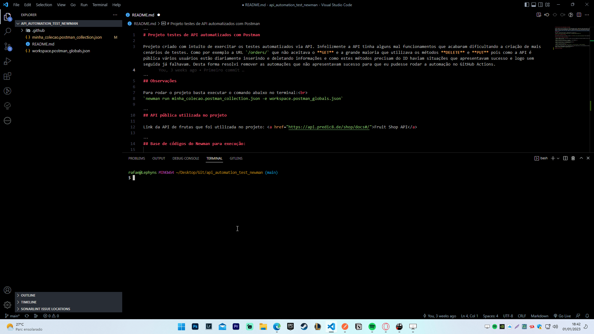
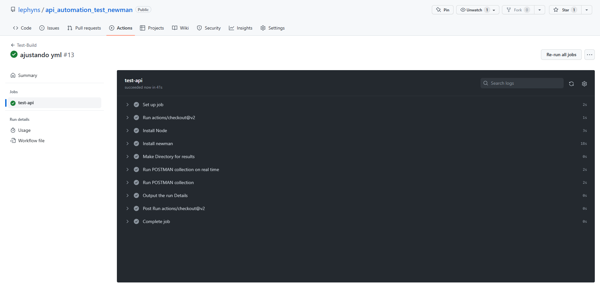
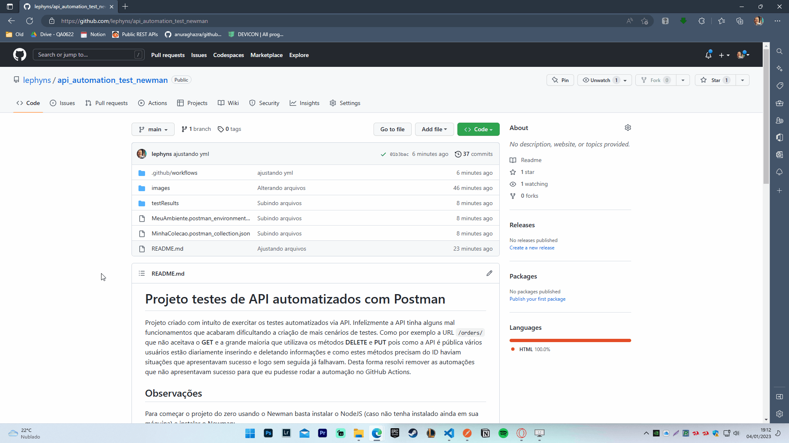

# Projeto testes de API automatizados com Postman

Projeto criado com intuíto de exercitar os testes automatizados via API. Infelizmente a API tinha alguns mal funcionamentos que acabaram dificultando a criação de mais cenários de testes. Como por exemplo a URL `/orders/` que não aceitava o **GET** e a grande maioria que utilizava os métodos **DELETE** e **PUT** pois como a API é pública vários usuários estão diariamente inserindo e deletando informações e como estes métodos precisam do ID haviam situações que apresentavam sucesso e logo sem seguida já falhavam. Desta forma resolvi remover as automações que não apresentavam sucesso para que eu pudesse rodar a automação no GitHub Actions.

Efetuado automação com o Github Actions onde a cada commit efetuado o job é rodado gerando o relatório do newman automaticamente e inserindo o mesmo dentro da pasta `testResults`. Para que a automação fosse rodada foi criado o arquivo `main.yml` com códigos necessários para que o job rodasse corretamente.

## Observações

Para começar o projeto do zero usando o Newman basta instalar o NodeJS (caso não tenha instalado ainda em sua máquina) e instalar o Newman: 

`npm install -g newman`

Para rodar o projeto basta executar o comando abaixo no terminal: 
`newman run minha_colecao.postman_collection.json -e workspace.postman_globals.json`

## API pública utilizada no projeto

Link da API de frutas que foi utilizada no projeto: <a href="https://api.predic8.de/shop/docs#/">Fruit Shop API</a>

## Base de códigos do Newman para execução:

 - Executar apenas uma coleção. Isso pode ser usado se não houver dependência de arquivo de dados de teste ou ambiente: 
`newman run <nome da coleção>`

- Executar uma coleção e um ambiente. O indicador -e é para ambiente: 
`newman run <nome da coleção> -e <nome do ambiente>`

- Executar uma coleção com o número desejado de iterações: 
`newman run <nome da coleção> -n <nº de iterações>`

 - Executar com arquivo de dados: 
`newman run <nome da coleção> --data <nome do arquivo> -n <nº de iterações> -e <nome do ambiente>`

- Para definir o tempo de atraso. Isso é importante, pois os testes podem falhar se forem executados sem atraso, devido a solicitações iniciadas sem que a solicitação anterior conclua o processamento no servidor de terminal: 
`newman run <nome da coleção> -d <tempo de atraso>`

## Execução no terminal

Abaixo gif exibindo a execução dos testes no terminal, no exemplo abaixo executando pelo terminal apresentou erro (status code `400`) no caminho `{{url}}/orders/301` porém ao executar no Postman percebemos que o cenário é diferente pois apresentou status `200`:  

## Execução do job no Github Actions

Ao efetuar um commit na branch **main** o job é rodado automaticamente:

Após o job ser finalizado o relatório estará na pasta `testResults` o qual ao ser aberto exibirá o relatório do newman:

